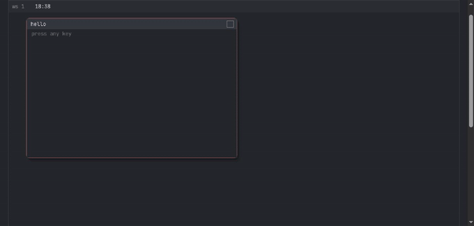
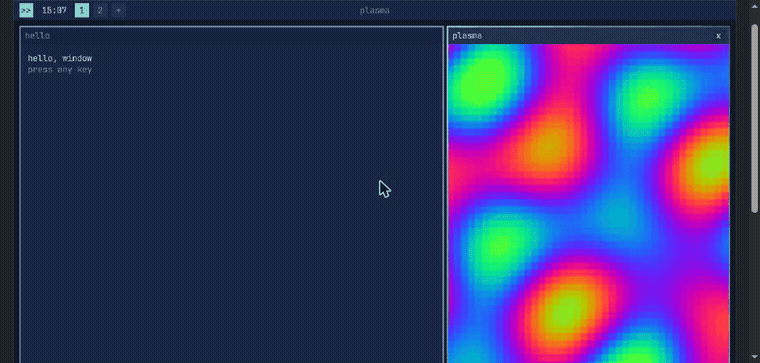

<div align="center">

# aster

**A desktop environment written in Lua.**
It needs a framebuffer, a keyboard, and somewhere to keep one file. Nothing else —
no X server, no Wayland, no compositor.

That one file *is* the window manager, and you edit it *while it's running* — with your
windows still open.

</div>

<br>

<div align="center">
  
</div>

<br>

<div align="center">

**[Try it in your browser →](https://xelvra.github.io/aster-wm)** — no install, runs in a
`<canvas>`, same code as everywhere else.

</div>

<br>

## Install

Grab a binary from [Releases](https://github.com/Xelvra/aster-wm/releases) — Linux, macOS,
Windows.

Building from source:

```bash
git clone https://github.com/Xelvra/aster-wm
cd aster-wm
zig build run
```

<br>

## This is not a config file

Every other hackable WM lets you configure behavior on top of someone else's code —
AwesomeWM, Hyprland, Qtile all put a scripting layer over tens of thousands of lines of C
you never touch. You can change a keybinding. You can't change how a window is drawn,
because that lives one floor down, in a language you can't see into.

> ### `~/.config/aster/wm.lua` is not a config file.
> ### It **is** the window manager.

Not a layer above it. Not a set of options it reads. The file itself.

```lua
function wm:draw_frame(win)
  local c = win.focused and self.theme.accent or self.theme.inactive
  aster.render.round_rect(self.surface, win.x, win.y, win.w, win.h, 8, c)
end
```

Change that function, hit `Ctrl+S`, and every window on screen redraws — right now, with no
restart, no relog, no recompile. **Your windows stay open and keep their contents.** A typo
doesn't cost you anything either: if the file doesn't compile, the previous version keeps
running and you get told which line is wrong.

<div align="center">
  
</div>

<br>

## Why this exists

Split the world of desktops into two piles.

**Pile one — configurable window managers.** AwesomeWM, Hyprland, Qtile, XMonad. Great
projects. But in every one of them you configure *what the WM does*, never *what the WM is*.
And all of them sit on top of X11 or Wayland — 300,000+ lines of someone else's code that
has to already be running before yours starts.

**Pile two — toy WMs.** Framebuffer demos, osdev experiments. Genuinely hackable, but they
don't do anything. They draw a rectangle and stop.

Nothing sits between the two piles. aster does: a desktop with a tiling WM, a bar, a
launcher, an editor, a file browser and a REPL — real work — whose core is under 1,600 lines
of Lua you can read in an afternoon and rewrite in a weekend.

That number is not a slogan. It's checked by CI on every push.

<br>

## Runs anywhere there's a framebuffer

The same `wm.lua` runs unmodified across every backend. A twelve-function host contract is
the only boundary in the whole system — Lua never touches anything below it.

| Backend | What it gets you |
|---|---|
| **SDL2** | a window on Linux, macOS, or Windows |
| **DRM/KMS + evdev** | *is* your desktop — boots straight to it, no X, no Wayland |
| **WebAssembly** | the live demo above, in any browser |
| **Bare metal** | boots on real hardware from a Limine ISO, no OS underneath |

A backend isn't "done" because someone says so — it's done when it passes the same
[conformance suite](spec/conformance/) as every other one. Where a backend genuinely can't
do something (there are no processes to spawn in a browser), it says so, and the desktop
adapts instead of breaking.

<br>

## What Lua does, what Zig does

Lua decides. Zig draws. Lua never runs on the hot path — no per-pixel loops — so its being
an interpreted language costs nothing and buys everything: the whole system stays editable
at runtime.

```
Zig   fill_rect · round_rect · rect_border · gradient_border · glyph · blit · clip
Lua   wm · bar · launcher · input · editor · files · repl · your apps
```

The renderer never knows what a window is. It draws rectangles and glyphs — windows, tiling,
focus, all of it is composed in Lua, on top.

<br>

## Contributing

The way in is Lua, not Zig.

- **[`themes/`](themes/)** — four examples, a fifth is a five-minute PR
- **[`apps/`](apps/)** — an app is a table with a `draw` function;
  [`hello-window.lua`](apps/hello-window.lua) is 30 lines
- **[`good-first-issue`](https://github.com/Xelvra/aster-wm/labels/good-first-issue)**

```bash
zig build && zig build test
```

That's the whole review bar. See [`CONTRIBUTING.md`](CONTRIBUTING.md).

<br>

## A note on trust

aster has no security boundary, on purpose — `wm.lua` runs with your full permissions,
because a sandbox is the thing that would make it unhackable. **A theme is code, not data.**
Read a `themes/` or `apps/` file before you run it, the same way you'd read a shell script
someone sent you.

<br>

## Where this came from

aster started as [`aster-os`](https://github.com/Xelvra/aster-os), an experimental kernel
written in Zig — boot, memory management, APIC, a filesystem, a Lua desktop running on bare
metal. The OS taught what it needed to teach. The desktop it produced turned out to be the
interesting part, so the kernel became backend #4 instead of the foundation.

<br>

## And yes, it boots without an OS at all

<div align="center">
  
</div>

<br>

<div align="center">

MIT License · [spec/architecture.md](spec/architecture.md) ·
[spec/host-contract.md](spec/host-contract.md)

</div>
